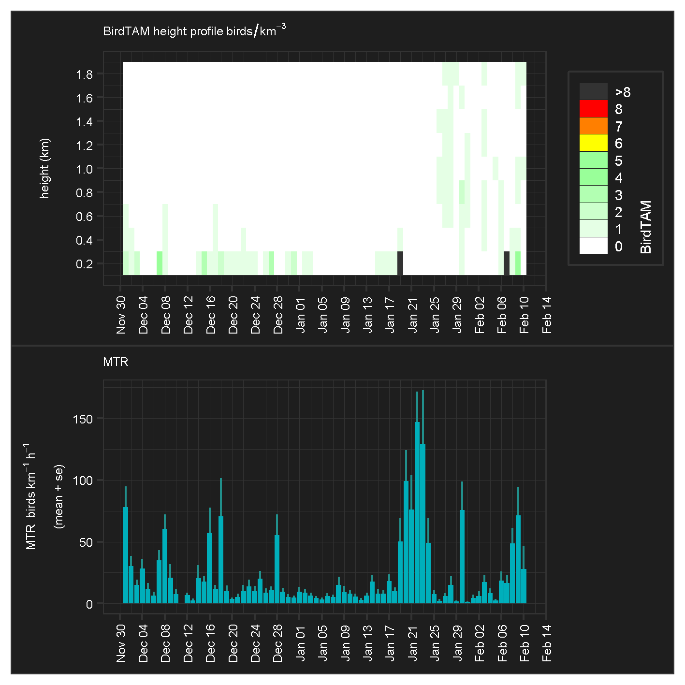
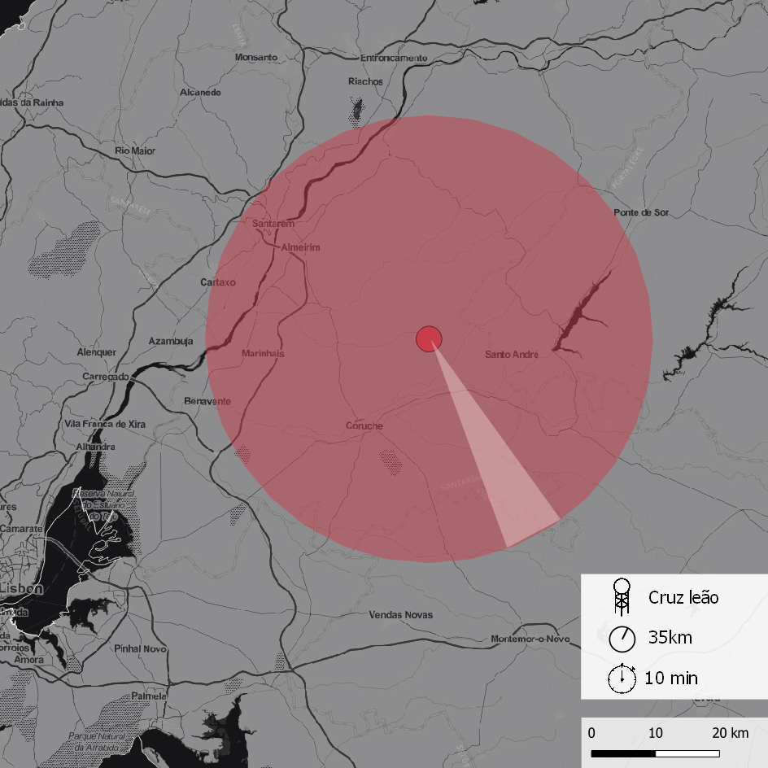

## Motivation

The goal of `radarweather` is to gather and process weather radar data from [Aloft - Bird movement data from European weather radars](https://aloftdata.eu/) Network, specifically for Coruche/Cruz do Leão radar (ptlis) with [bioRad](https://github.com/adokter/bioRad) package to create a set of specific outputs.

## Exemple of Output

## Radar location

